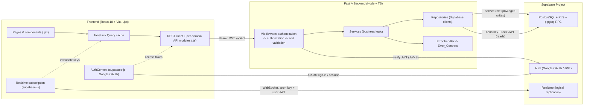
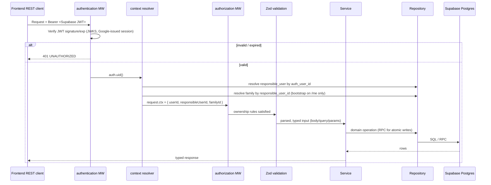
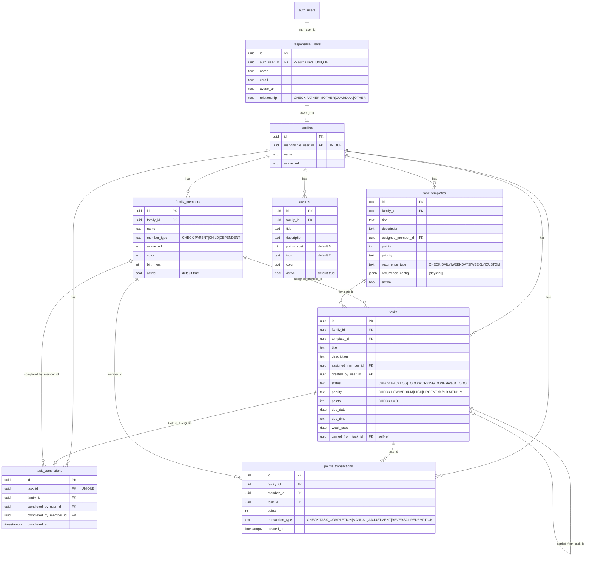

# Design Document

## Overview

This design delivers the Family Task Board as two independently deployable applications wired to a single Supabase project:

1. A **Node.js + TypeScript + Fastify backend** exposing a versioned REST API under `/api/v1`. It reproduces and hardens the three existing Base44 serverless functions (`completeTask`, `reopenTask`, `generateRecurring`) plus full CRUD for families, members, tasks, templates, awards, and the points ledger. It is backed by Supabase PostgreSQL with Row-Level Security (RLS), Supabase Auth (Google OAuth), Realtime, reproducible SQL migrations, and idempotent seed data.
2. A **frontend data-layer migration** that removes the `@base44/sdk`, swaps `src/api/base44Client.js` for a typed REST client plus per-domain API modules authored in TypeScript, repoints the `useFamily.js` TanStack Query hooks at the new client (keeping identical query keys), reworks `AuthContext.jsx` to use Supabase Google OAuth, and adds realtime cache invalidation, optimistic completion, and a landscape Wall Mode. All existing `.jsx` pages and components are preserved (DP-1).

### How the design maps to the requirements

| Requirement group | Where addressed |
| --- | --- |
| R1 Auth & bootstrap | Auth middleware (JWT verify), `/me` service with first-login family creation; email/password pages removed |
| R2 Family | `family` module; responsible_users ⇄ families split mapped to a single frontend "family" object |
| R3 Members | `members` module with soft-delete |
| R4–R7 Tasks (CRUD/list/move) | `tasks` module; move guards DONE |
| R8–R11 Completion/reopen/ledger | `completions` + `gamification` modules; atomic Postgres functions via RPC |
| R12–R13 Templates & recurring | `tasks` (templates) module; idempotent generation keyed `template_id\|due_date` |
| R14 Carry-over | `tasks` module carry-over service |
| R15–R17 Leaderboard/dashboard/board | `gamification` + `dashboard` modules; ledger-sum math ported from `familyUtils.js` |
| R18 Awards & redemption | `gamification` (awards) module; atomic balance-guarded redemption |
| R19–R22 Wall Mode / parity / realtime / optimistic | Frontend design section |
| R23 Security/RLS/validation | RLS policies + authorization middleware + Zod + service-role write path |
| R24 Data-layer migration | Frontend REST client + per-domain modules + Supabase Auth wiring |
| R25 Error contract | Error-handler middleware + shared error classes |
| R26 Observability | pino structured logging, `/health`, `/ready` |
| R27 API docs | `@fastify/swagger` at `/api/docs` |
| R28 Migrations & seed | `supabase/migrations/*` + idempotent `seed.sql` |
| R29 Docker/CORS/env | `backend/Dockerfile`, `frontend/Dockerfile`, root `docker-compose.yml`, startup env validation |
| R30 Build/test/DoD | Vitest backend + frontend suites; `tsc` typecheck |
| R31 Accessibility | Frontend accessibility concerns in UI design |

## Architecture

### System diagram



### Request lifecycle

Every `/api/v1` request (except `/health`, `/ready`, `/api/docs`) flows through a fixed pipeline:



Key points:

- The **RESPONSIBLE_User identity is derived solely from the verified JWT** (`auth.uid()`), never from the body, query, or headers (R1.7, R23.2).
- A **context resolver** runs once per request to map `auth.uid()` → `responsible_users.id` → `families.id`, attaching `request.ctx`. The family is created only inside `GET /me` (R1.4); for all other routes a missing family resolves to 404.
- `family_id`, `created_by_user_id`, `completed_by_user_id`, and ledger `points` are always derived server-side (R4.2, R8.3, R10.6, R23.2).

### RLS vs. service-role responsibility split

Two Supabase clients are constructed in the backend:

| Client | Key | JWT | Used for | Why |
| --- | --- | --- | --- | --- |
| **User-scoped client** | anon key | forwarded user JWT | Reads and simple owner-scoped CRUD | RLS enforces family isolation as a database-level backstop. Even if a service bug omitted a filter, PostgreSQL rejects foreign rows. Defense in depth for R23.1. |
| **Service-role client** | `SUPABASE_SERVICE_ROLE_KEY` | none (bypasses RLS) | Privileged ledger writes, atomic completion/reopen/redemption RPCs | These operations must insert `points_transactions` rows and set `points`/`member_id` values the client is forbidden from supplying (R23.6). They also run multi-statement transactions that must succeed atomically. Running them as service role lets the backend be the sole authority on point awards while enforcing ownership **in code** before every privileged write. |

**Rule:** privileged writes (completion, reopen, redemption, carry-over, recurring generation) go through the **service role inside a Postgres function**, and the service performs the ownership check (`task.family_id === request.ctx.familyId`) *before* invoking it. Reads and plain CRUD use the **user-scoped client** so RLS provides a second, independent isolation guarantee. The service-role key is server-only and never returned in any response (R23.5).

## Data Models

### Entity-relationship diagram



### DDL overview

Enums are implemented as `TEXT ... CHECK (...)` constraints (matching the Base44 field names and keeping migrations portable). Timestamps are `timestamptz` with `created_at`/`updated_at` defaults; an `updated_at` trigger refreshes on write.

```sql
-- responsible_users: one row per authenticated adult
create table responsible_users (
  id uuid primary key default gen_random_uuid(),
  auth_user_id uuid not null unique references auth.users(id) on delete cascade,
  name text,
  email text,
  avatar_url text,
  relationship text check (relationship in ('FATHER','MOTHER','GUARDIAN','OTHER')),
  created_at timestamptz not null default now(),
  updated_at timestamptz not null default now()
);

create table families (
  id uuid primary key default gen_random_uuid(),
  responsible_user_id uuid not null unique references responsible_users(id) on delete cascade,
  name text not null,
  avatar_url text,
  created_at timestamptz not null default now(),
  updated_at timestamptz not null default now()
);

create table family_members (
  id uuid primary key default gen_random_uuid(),
  family_id uuid not null references families(id) on delete cascade,
  name text not null,
  member_type text not null check (member_type in ('PARENT','CHILD','DEPENDENT')),
  avatar_url text, color text, birth_year int,
  active boolean not null default true,
  created_at timestamptz not null default now(),
  updated_at timestamptz not null default now()
);

create table task_templates (
  id uuid primary key default gen_random_uuid(),
  family_id uuid not null references families(id) on delete cascade,
  title text not null, description text,
  assigned_member_id uuid references family_members(id),
  points int not null default 0 check (points >= 0),
  priority text not null default 'MEDIUM' check (priority in ('LOW','MEDIUM','HIGH','URGENT')),
  recurrence_type text not null check (recurrence_type in ('DAILY','WEEKDAYS','WEEKLY','CUSTOM')),
  recurrence_config jsonb not null default '{}'::jsonb,
  active boolean not null default true,
  created_at timestamptz not null default now(),
  updated_at timestamptz not null default now()
);

create table tasks (
  id uuid primary key default gen_random_uuid(),
  family_id uuid not null references families(id) on delete cascade,
  template_id uuid references task_templates(id) on delete set null,
  title text not null, description text,
  assigned_member_id uuid references family_members(id),
  created_by_user_id uuid not null references responsible_users(id),
  status text not null default 'TODO' check (status in ('BACKLOG','TODO','WORKING','DONE')),
  priority text not null default 'MEDIUM' check (priority in ('LOW','MEDIUM','HIGH','URGENT')),
  points int not null default 0 check (points >= 0),
  due_date date, due_time text, week_start date,
  carried_from_task_id uuid references tasks(id) on delete set null,
  created_at timestamptz not null default now(),
  updated_at timestamptz not null default now()
);

create table task_completions (
  id uuid primary key default gen_random_uuid(),
  task_id uuid not null unique references tasks(id) on delete cascade,  -- R9.1
  family_id uuid not null references families(id) on delete cascade,
  completed_by_user_id uuid not null references responsible_users(id),
  completed_by_member_id uuid not null references family_members(id),
  completed_at timestamptz not null default now()
);

create table points_transactions (
  id uuid primary key default gen_random_uuid(),
  family_id uuid not null references families(id) on delete cascade,
  member_id uuid not null references family_members(id),
  task_id uuid references tasks(id) on delete set null,
  points int not null,
  transaction_type text not null
    check (transaction_type in ('TASK_COMPLETION','MANUAL_ADJUSTMENT','REVERSAL','REDEMPTION')), -- R18.12
  created_at timestamptz not null default now()
);

create table awards (
  id uuid primary key default gen_random_uuid(),
  family_id uuid not null references families(id) on delete cascade,
  title text not null, description text,
  points_cost int not null default 0 check (points_cost >= 0),
  icon text not null default '🎁', color text,
  active boolean not null default true,
  created_at timestamptz not null default now(),
  updated_at timestamptz not null default now()
);
```

### Indexes (migration `002_indexes.sql`)

```sql
create index on family_members(family_id);
create index on task_templates(family_id) where active;
create index on tasks(family_id, week_start);
create index on tasks(family_id, due_date);
create index on tasks(family_id, status);
create index on tasks(family_id, assigned_member_id);
create unique index on tasks(template_id, due_date) where template_id is not null; -- recurring idempotency backstop
create index on task_completions(family_id);
create index on points_transactions(family_id, member_id);
create index on points_transactions(family_id, created_at);
create index on awards(family_id) where active;
```

The partial unique index on `tasks(template_id, due_date)` is the database-level backstop for R13.7/R13.8 idempotency; the generation service also checks in code so it can skip (not error) on existing rows.

### responsible_users / families → single frontend "family" object

The frontend Settings and Family pages treat the family as one object with `name`, `avatar_url`, `relationship`, and `responsible_name`. The backend splits this: household data (`name`, `avatar_url`) lives on `families`; the responsible adult's data (`relationship`, display name) lives on `responsible_users`. The API reconciles this by **composing a single DTO** on read and **routing fields to the correct table** on write.

`GET /api/v1/me` and `GET /api/v1/family` return:

```jsonc
{
  "family": {
    "id": "uuid",
    "name": "Rodrigues Family",          // families.name
    "avatar_url": "https://…",            // families.avatar_url
    "relationship": "FATHER",             // responsible_users.relationship
    "responsible_name": "João Rodrigues"  // responsible_users.name
  },
  "responsibleUser": {
    "id": "uuid", "email": "…", "avatar_url": "…"
  }
}
```

`PATCH /api/v1/family` accepts the same flat shape and the service writes `name`/`avatar_url` to `families` and `relationship`/`responsible_name`(→`name`) to `responsible_users` in one transaction, so the frontend keeps its single-object mental model unchanged (R2.2).

### Atomic completion: Postgres function via RPC (chosen approach)

**Decision:** implement completion, reopen, and redemption as **plpgsql functions invoked via `supabase.rpc(...)` using the service-role client**, rather than as application-level transactions over the Supabase JS client.

**Justification:** the Supabase JS client issues one HTTP request per statement and has no first-class multi-statement transaction primitive, so an application-level "transaction" would be several independent REST calls that cannot roll back together — exactly the partial-write hazard R10.4/R10.5/R11.6 forbid. A single plpgsql function runs in one implicit transaction on the database: all inserts/updates commit or roll back atomically, and the `UNIQUE(task_id)` constraint plus `SELECT … FOR UPDATE` row locks give correct behavior under concurrency (R9.4, R11.9, R18.11) in a single network round trip. The functions live in migration `004_functions.sql` and run `SECURITY DEFINER` so they can write the ledger while the backend enforces ownership before calling them.

```sql
-- complete_task(p_task_id, p_member_id, p_user_id) -> jsonb
-- Preconditions checked by caller: task & member belong to session family.
create function complete_task(p_task_id uuid, p_member_id uuid, p_responsible_user_id uuid)
returns jsonb language plpgsql security definer as $$
declare v_task tasks; v_now timestamptz := now(); v_awarded int := 0;
begin
  select * into v_task from tasks where id = p_task_id for update;      -- lock row
  if not found then raise exception 'NOT_FOUND'; end if;
  if v_task.status = 'DONE' then raise exception 'TASK_ALREADY_COMPLETED'; end if;

  insert into task_completions(task_id, family_id, completed_by_user_id, completed_by_member_id, completed_at)
  values (p_task_id, v_task.family_id, p_responsible_user_id, p_member_id, v_now);  -- UNIQUE(task_id) guards duplicates

  if v_task.points > 0 then
    insert into points_transactions(family_id, member_id, task_id, points, transaction_type)
    values (v_task.family_id, p_member_id, p_task_id, v_task.points, 'TASK_COMPLETION');
    v_awarded := v_task.points;
  end if;

  update tasks set status = 'DONE', updated_at = now() where id = p_task_id;
  return jsonb_build_object('status','DONE','completedAt',v_now,
                            'completedByMemberId',p_member_id,'awarded',v_awarded);
exception
  when unique_violation then raise exception 'TASK_ALREADY_COMPLETED';
end $$;
```

`reopen_task` and `redeem_award` follow the same pattern (lock the task/compute the member balance with `FOR UPDATE`, write the REVERSAL/REDEMPTION row, update status, raise named exceptions that the error handler maps to codes). The repository maps raised exception messages (`NOT_FOUND`, `TASK_ALREADY_COMPLETED`, `INSUFFICIENT_POINTS`) to the shared error classes.

## RLS Policy Design

RLS is enabled on **every** table (R23.1). The ownership chain is always `auth.uid()` → `responsible_users.auth_user_id` → `responsible_users.id` → `families.responsible_user_id` → `family_id`. A SQL helper centralizes the resolution:

```sql
create function current_family_id() returns uuid language sql stable as $$
  select f.id from families f
  join responsible_users r on r.id = f.responsible_user_id
  where r.auth_user_id = auth.uid();
$$;
```

Per-table policy pattern (migration `003_rls.sql`):

| Table | SELECT / UPDATE / DELETE policy | INSERT policy |
| --- | --- | --- |
| `responsible_users` | `auth_user_id = auth.uid()` | self only |
| `families` | `responsible_user_id = (select id from responsible_users where auth_user_id = auth.uid())` | own responsible_user |
| `family_members`, `task_templates`, `tasks`, `awards` | `family_id = current_family_id()` | `family_id = current_family_id()` |
| `task_completions`, `points_transactions` | **SELECT:** `family_id = current_family_id()`. **INSERT/UPDATE/DELETE:** no policy for the anon/user role → denied | — (writes only via service role) |

**Privileged-write rationale:** `task_completions` and `points_transactions` have **no insert/update/delete policy for the user-scoped role**, so a client holding a user JWT literally cannot write the ledger. All ledger writes happen through the `SECURITY DEFINER` RPC functions invoked by the service-role client, and the backend enforces `task.family_id === request.ctx.familyId` (and member-in-family) in code before calling them (R23.6). Reads of both tables remain family-scoped by RLS so the frontend (dashboard, points history, leaderboard) can read them directly with the user JWT.

## REST API Design

Base path: `/api/v1`. All routes require a valid Bearer JWT except `/health`, `/ready`, `/api/docs`. All request bodies, query params, and path params are validated with Zod; failures return `422 VALIDATION`. Responses are JSON; errors use the Error_Contract.

Notation: `✎` = Zod schema name. Common error codes per route are listed; `UNAUTHORIZED (401)` and `INTERNAL (500)` are implicit on every route.

### Auth / bootstrap module

| Method | Path | Request | Response | Errors |
| --- | --- | --- | --- | --- |
| GET | `/me` | — | `{ family, responsibleUser }` (creates family if none) | — |

### Family module

| Method | Path | Request ✎ | Response | Errors |
| --- | --- | --- | --- | --- |
| GET | `/family` | — | `{ family }` | 404 NOT_FOUND |
| PATCH | `/family` | `FamilyUpdate` `{ name?, avatar_url?, relationship?, responsible_name? }` | `{ family }` | 422 VALIDATION |

### Members module

| Method | Path | Request ✎ | Response | Errors |
| --- | --- | --- | --- | --- |
| GET | `/family/members` | `?active?` | `{ members: Member[] }` | — |
| POST | `/family/members` | `MemberCreate` `{ name, member_type, avatar_url?, color?, birth_year? }` | `201 { member }` | 422 VALIDATION |
| PATCH | `/family/members/:id` | `MemberUpdate` | `{ member }` | 404, 422 |
| DELETE | `/family/members/:id` | — | `{ member }` (active=false, soft delete) | 404 |

### Tasks module

| Method | Path | Request ✎ | Response | Errors |
| --- | --- | --- | --- | --- |
| GET | `/family/tasks` | `TaskFilter` `?date?&weekStart?&status?&memberId?&priority?` | `{ tasks: Task[] }` | 422 |
| POST | `/family/tasks` | `TaskCreate` `{ title, description?, assigned_member_id?, priority?, points?, due_date?, due_time?, week_start? }` | `201 { task }` | 422 |
| PATCH | `/tasks/:id` | `TaskUpdate` | `{ task }` | 404, 422 |
| DELETE | `/tasks/:id` | — | `204` | 404 |
| POST | `/tasks/:id/move` | `TaskMove` `{ status: BACKLOG\|TODO\|WORKING }` | `{ task }` | 422 (DONE rejected), 404 |
| POST | `/tasks/:id/complete` | `TaskComplete` `{ completedByMemberId }` | `201 { task:{status:'DONE',completedAt}, completion:{completedByMemberId}, points:{awarded} }` | 422, 403, 404, 409 TASK_ALREADY_COMPLETED |
| POST | `/tasks/:id/reopen` | — | `200 { task, reversedPoints }` | 422, 404 |
| POST | `/family/tasks/carry-over` | `CarryOver` `{ targetDate? , targetWeekStart? }` | `{ created }` | 422 |

Rejecting a client-supplied `points`/`member_id` on a ledger-adjacent create/update returns `403 FORBIDDEN` (R23.6).

### Task-templates module

| Method | Path | Request ✎ | Response | Errors |
| --- | --- | --- | --- | --- |
| GET | `/family/task-templates` | — | `{ templates: Template[] }` | — |
| POST | `/family/task-templates` | `TemplateCreate` `{ title, recurrence_type, recurrence_config?, ... }` | `201 { template }` | 422 (CUSTOM needs days[0..6]) |
| PATCH | `/task-templates/:id` | `TemplateUpdate` | `{ template }` | 404, 422 |
| DELETE | `/task-templates/:id` | — | `204` (deactivate) | 404 |
| POST | `/family/task-templates/generate` | `Generate` `{ weekStart }` | `{ weekStart, created }` | 422 (missing/malformed/non-Monday) |

### Gamification module (points, leaderboard, awards)

| Method | Path | Request ✎ | Response | Errors |
| --- | --- | --- | --- | --- |
| GET | `/family/points` | `?memberId?&from?&to?` | `{ transactions: Txn[] }` | 422 |
| GET | `/family/leaderboard` | `?period=today\|week\|month\|all` | `{ entries: [{memberId,name,color,points,completedTasks}] }` | 422 |
| GET | `/family/members/:id/completions` | — | `{ completions, transactions }` (MemberProfile) | 404 |
| GET | `/family/awards` | — | `{ awards: Award[] }` | — |
| POST | `/family/awards` | `AwardCreate` `{ title(1..200), points_cost(0..999999), ... }` | `201 { award }` | 422 |
| PATCH | `/awards/:id` | `AwardUpdate` | `{ award }` | 404, 422 |
| DELETE | `/awards/:id` | — | `204` (active=false) | 404 |
| POST | `/awards/:id/redeem` | `Redeem` `{ memberId }` | `201 { transaction }` | 422 VALIDATION / INSUFFICIENT_POINTS, 403, 404 |

### Dashboard & board module

| Method | Path | Request ✎ | Response | Errors |
| --- | --- | --- | --- | --- |
| GET | `/family/dashboard` | — | `{ family, members, todayTasks, totals:{[memberId]:points} }` | — |
| GET | `/family/board` | `?weekStart` | `{ weekStart, tasks, byDay, byStatus }` | 422 |

### Ops & docs

| Method | Path | Response |
| --- | --- | --- |
| GET | `/api/v1/health` | `200` while process is up (R26.2) |
| GET | `/api/v1/ready` | `200` if Supabase reachable, else `503` (R26.3/26.4) |
| GET | `/api/docs` | OpenAPI UI documenting all `/api/v1` routes (R27) |

### Example Zod schemas

```ts
export const Relationship = z.enum(['FATHER','MOTHER','GUARDIAN','OTHER']);
export const MemberType  = z.enum(['PARENT','CHILD','DEPENDENT']);
export const TaskStatus  = z.enum(['BACKLOG','TODO','WORKING','DONE']);
export const Priority    = z.enum(['LOW','MEDIUM','HIGH','URGENT']);
export const Recurrence  = z.enum(['DAILY','WEEKDAYS','WEEKLY','CUSTOM']);

export const TaskCreate = z.object({
  title: z.string().min(1),
  description: z.string().optional(),
  assigned_member_id: z.string().uuid().optional(),
  priority: Priority.default('MEDIUM'),
  points: z.number().int().min(0).default(0),      // R4.6
  due_date: z.string().date().optional(),
  due_time: z.string().optional(),
  week_start: z.string().date().optional(),
}).strict();   // strict() => client-supplied family_id/created_by_user_id/status rejected

export const TaskMove = z.object({ status: z.enum(['BACKLOG','TODO','WORKING']) }).strict(); // DONE excluded -> 422 (R7.2)
export const TaskComplete = z.object({ completedByMemberId: z.string().uuid() }).strict();   // R8.5
export const Generate = z.object({ weekStart: z.string().date() }).strict();                 // Monday check in service (R13.9)
export const TemplateCreate = z.object({
  title: z.string().min(1),
  recurrence_type: Recurrence,
  recurrence_config: z.object({ days: z.array(z.number().int().min(0).max(6)) }).optional(),
  // ...
}).strict().superRefine((v,ctx) => {               // R12.5
  if (v.recurrence_type === 'CUSTOM' && !v.recurrence_config?.days?.length)
    ctx.addIssue({ code:'custom', message:'CUSTOM requires recurrence_config.days[0..6]' });
});
export const AwardCreate = z.object({
  title: z.string().min(1).max(200),               // R18.2
  points_cost: z.number().int().min(0).max(999999),
  description: z.string().optional(), icon: z.string().optional(), color: z.string().optional(),
}).strict();
```

## Components and Interfaces

### Module layout

```
backend/
  src/
    config/
      env.ts                 # Zod-validated env; fail-fast at startup (R29.9)
      supabase.ts            # builds user-scoped + service-role clients
    middleware/
      authentication.ts      # verify Supabase JWT (JWKS), attach auth.uid()
      context.ts             # resolve responsible_user + family -> request.ctx
      authorization.ts       # ownership guards (family scoping, IDOR -> 404)
      error-handler.ts       # catch -> Error_Contract + HTTP code
    modules/
      auth/        { controller, service, routes }        # /me bootstrap
      family/      { controller, service, repository, routes, schemas }
      members/     { ... }
      tasks/       { ... }                                 # CRUD, move, filter, carry-over, templates, generate
      completions/ { ... }                                 # complete, reopen (RPC calls)
      gamification/{ ... }                                 # points, leaderboard, awards, redeem
      dashboard/   { ... }                                 # dashboard, board
    shared/
      errors/      AppError, Unauthorized, Forbidden, NotFound, Validation, Conflict, InsufficientPoints
      types/       DTOs & DB row types
      utils/       dates (UTC weekday, week dates), ledger math (sum, leaderboard)
      constants/   enums, periods
    app.ts         # Fastify instance: plugins, swagger, cors, routes, hooks
    server.ts      # listen(PORT), graceful shutdown
  supabase/
    migrations/ 001_initial_schema.sql 002_indexes.sql 003_rls.sql 004_functions.sql 005_realtime.sql
    seed.sql
  tests/ { unit, integration }
```

### Layering

- **Routes** register the path + Zod schemas (via `fastify-type-provider-zod`) and bind to a controller.
- **Controllers** translate HTTP ↔ service calls; they read `request.ctx` (never the body) for identity.
- **Services** hold business logic (bootstrap, recurrence rule evaluation, carry-over eligibility, leaderboard math) and call repositories.
- **Repositories** are the only layer touching Supabase; they choose the user-scoped client (reads/CRUD) or service-role RPC (ledger writes).

### Middleware

- **authentication.ts** — verifies the Bearer JWT against the Supabase JWKS (issuer must be the project's Google-OAuth-backed Auth), checks expiry; failure → `401 UNAUTHORIZED` (R1.2/R1.3). It does **not** trust any `userId` from the payload beyond the signed `sub`.
- **context.ts** — resolves `responsible_users` by `auth_user_id` and `families` by `responsible_user_id`, attaching `{ userId, responsibleUserId, familyId }`. On `/me` it creates the family if absent (R1.4) with a `UNIQUE(responsible_user_id)` guard ensuring at most one (R1.6). Elsewhere a missing family → 404.
- **authorization.ts** — for by-id routes, loads the resource and asserts `resource.family_id === ctx.familyId`; mismatch or not-found both yield `404 NOT_FOUND` so existence is never disclosed (R23.3). Member-not-in-family on completion/redeem → `403 FORBIDDEN`.
- **error-handler.ts** — Fastify `setErrorHandler`; maps `AppError` subclasses and Zod errors to the Error_Contract and strips internals.

### Shared errors → Error_Contract

```ts
class AppError extends Error { constructor(public code: string, public http: number, msg: string){ super(msg);} }
class Unauthorized      extends AppError { constructor(){ super('UNAUTHORIZED',401,'Authentication required'); } }
class Forbidden         extends AppError { constructor(m='Forbidden'){ super('FORBIDDEN',403,m); } }
class NotFound          extends AppError { constructor(m='Resource not found'){ super('NOT_FOUND',404,m); } }
class ValidationError   extends AppError { constructor(m='Invalid request'){ super('VALIDATION',422,m); } }
class Conflict          extends AppError { constructor(){ super('TASK_ALREADY_COMPLETED',409,'This task has already been completed.'); } }
class InsufficientPoints extends AppError{ constructor(){ super('INSUFFICIENT_POINTS',422,'Insufficient points for this redemption.'); } }
```

### Logging, config, CORS

- **pino** structured logging via Fastify. A `redact` list removes `authorization`, `*.token`, `*.service_role*`, cookies, and request bodies on auth routes so secrets never land in logs (R26.1).
- **config/env.ts** parses `PORT, NODE_ENV, SUPABASE_URL, SUPABASE_ANON_KEY, SUPABASE_SERVICE_ROLE_KEY, CORS_ORIGIN` with Zod at startup; a missing var throws a descriptive error naming the key only (never the value) and exits non-zero (R29.9).
- **CORS** via `@fastify/cors`: in `production` the origin is the allowlist from `CORS_ORIGIN` (comma-split) and a wildcard `*` is refused (R29.8); in development it may echo localhost origins.

### Frontend Components and Interfaces

The migration is a **data-layer swap** (DP-1): `.jsx` pages and components are untouched; only the data-access and auth wiring change.

#### REST client + per-domain modules

```
src/api/
  client.ts          # fetch wrapper: base = VITE_API_URL + '/api/v1'
  family.api.ts members.api.ts tasks.api.ts templates.api.ts
  points.api.ts awards.api.ts dashboard.api.ts
  types.ts           # shared DTOs
```

`client.ts` responsibilities:
- Attach `Authorization: Bearer <access_token>` from the current Supabase session on every request.
- Parse responses; on non-2xx, read the Error_Contract and throw a typed `ApiError { code, message, status }`.
- On `401`, trigger the AuthContext's `redirectToLogin()` (Google OAuth) (R24.5).
- Serialize query params for list/filter endpoints.

Per-domain modules expose typed functions (e.g. `tasks.list(filter)`, `tasks.complete(id, { completedByMemberId })`, `tasks.generate({ weekStart })`) that call `client.ts`. The `@base44/sdk` dependency and `src/api/base44Client.js` are removed (R24.2).

#### Repointing `useFamily.js` (identical query keys)

Each hook keeps its **exact TanStack Query key** so no component changes:

| Hook | Key (unchanged) | New source |
| --- | --- | --- |
| `useFamily` | `['family']` | `family.api.get()` |
| `useMembers` | `['members',{activeOnly}]` | `members.api.list()` |
| `useTasks` | `['tasks', filters]` | `tasks.api.list(filters)` |
| `usePoints` | `['points']` | `points.api.list()` |
| `useTemplates` | `['templates']` | `templates.api.list()` |
| `useCompletions` | `['completions', memberId]` | `gamification member completions` |
| `useAwards` | `['awards']` | `awards.api.list()` |
| `useCompleteTask` | invalidates `['tasks']`,`['points']` | `tasks.api.complete()` |
| `useReopenTask` | invalidates `['tasks']`,`['points']` | `tasks.api.reopen()` |
| `useGenerateRecurring` | invalidates `['tasks']` | `templates.api.generate()` |

Leaderboard/dashboard math: the backend now owns the authoritative computation (R15/R16), reproducing `familyUtils.computeLeaderboard`/`computeProgress`. The frontend uses the backend `/leaderboard` and `/dashboard` payloads directly; `familyUtils.js` display helpers (labels, date formatting, `computeProgress`) stay for local board rendering, while the leaderboard page drops its client-side `computeLeaderboard` call in favor of the API (keeping a client fallback is optional and out of the critical path).

#### AuthContext reworked for Supabase Google OAuth

`AuthContext.jsx` is rewritten to use `supabase-js`:
- `supabase.auth.signInWithOAuth({ provider: 'google' })` for login (replaces Base44 redirect).
- `supabase.auth.getSession()` + `onAuthStateChange` for session restore and reactive auth state.
- `supabase.auth.signOut()` for logout.
- Exposes `getAccessToken()` so `client.ts` can attach the Bearer token, and `redirectToLogin()` used by the 401 handler.
- `ProtectedRoute.jsx` stays; it now reads `isAuthenticated` from the reworked context.
- The email/password pages (`Register.jsx`, `ForgotPassword.jsx`, `ResetPassword.jsx`) and `OAuthConsent.jsx` Base44 handling are removed, along with their routes (R1.8, DP-3). `Login.jsx` becomes a single "Continue with Google" screen.

The frontend reads `VITE_API_URL`, `VITE_SUPABASE_URL`, `VITE_SUPABASE_ANON_KEY` (R24.6/R29.7).

#### Realtime subscription + cache invalidation

A `useRealtime(familyId)` hook subscribes via `supabase.channel()` to Postgres changes on `tasks`, `task_completions`, and `points_transactions` **filtered to the family** (`filter: family_id=eq.<familyId>`) (R21.2). On any event it calls `queryClient.invalidateQueries` for the matching keys (`['tasks']`, `['points']`), which re-fetches through the REST client. If the channel errors or disconnects, the hook enables a low-frequency `refetchInterval` fallback on those queries (R21.3). The subscription uses the anon key with the user JWT so RLS scopes the stream.

#### Optimistic completion with rollback

`useCompleteTask` uses TanStack Query `onMutate`/`onError`/`onSettled`:
- `onMutate`: cancel in-flight `['tasks']` queries, snapshot the cache, optimistically set the task's `status` to `DONE` (R22.1).
- `onError`: restore the snapshot (rollback) and surface a toast (R22.2).
- Awarded points are shown only from the server response in `onSuccess` (R22.3) — never optimistically.
- `onSettled`: invalidate `['tasks']` and `['points']`.

#### Wall Mode, responsiveness, energy, accessibility

- `/wall` route renders the board optimized for a 1024×768 landscape viewport (R19.1), gated by `ProtectedRoute` (R19.4), and consumes realtime updates (R19.5).
- Interactive controls use `min-h-11 min-w-11` (≥44×44 CSS px) touch targets (R19.2/R31.3).
- A `prefers-reduced-motion` media query (and the existing `framer-motion` reduced-motion support) suppresses non-essential animation in Wall Mode and app-wide (R19.3/R31.4).
- Accessibility: keyboard navigation + visible focus rings on all controls (R31.1), text contrast ≥ 4.5:1 via the Tailwind token palette (R31.2).

## Error Handling

All error responses share the Error_Contract `{ "error": { "code": string, "message": string } }` (R25.1). The error handler never emits stack traces, SQL text, or secrets; unexpected errors are logged server-side with full detail and returned to the client as a generic `INTERNAL` message (R25.3).

### Code ↔ HTTP mapping

| Code | HTTP | Trigger |
| --- | --- | --- |
| `VALIDATION` | 422 | Zod failure; bad enum/points/weekStart; CUSTOM days; move→DONE; inactive member; missing `completedByMemberId`/`memberId` |
| `UNAUTHORIZED` | 401 | Missing/invalid/expired session |
| `FORBIDDEN` | 403 | Member not in family (complete/redeem); attempt to set `points`/`member_id` directly |
| `NOT_FOUND` | 404 | Resource missing or belonging to another family (IDOR) |
| `TASK_ALREADY_COMPLETED` | 409 | Completing a DONE task or one with an existing completion |
| `INSUFFICIENT_POINTS` | 422 | Redemption would drive the derived total below 0 |
| `INTERNAL` | 500 | Unexpected failure |

## Testing Strategy

### Backend

- **Framework:** Vitest + Supertest (or Fastify `inject`) running against a **transactional test Postgres** (a disposable Supabase/Postgres instance with the migrations applied; each test wraps in a transaction rolled back on teardown, and the RPC functions run against the real schema so `UNIQUE(task_id)` and locks are exercised).
- **Property-based testing:** `fast-check` for the universal properties below (min 100 iterations each). PBT applies here because the completion/reopen/redemption/recurrence/ledger logic are effectively pure functions over a large input space (varying points, member sets, templates, periods, concurrency), where "for all inputs" statements are meaningful.
- **Required coverage (R30.2):** task CRUD; completion; duplicate-completion prevention; points awarding; reopen & reversal; carry-over; recurring generation; cross-family access denial; point-manipulation denial; IDOR protection.
- **Example/edge/integration tests:** move→DONE rejection; soft-delete retention; inactive/foreign member and foreign task error codes; weekStart/CUSTOM-days validation; health/ready (ready mocks Supabase reachable/unreachable → 200/503); `/api/docs` loads; migrations apply to an empty DB and seed is idempotent (run twice → equal counts); CORS rejects `*` in production and env validation fails fast.

### Frontend

- **Framework:** Vitest + React Testing Library (jsdom), with the REST client and Supabase client mocked.
- **Required coverage (R30.3):** authenticated login state; dashboard rendering; task completion with error rollback (optimistic DONE → error → restored); member management; board rendering; leaderboard rendering; Wall Mode (landscape layout, reduced-motion suppresses animation, ≥44px targets, focus visible).
- **Typecheck (R30.4):** `tsc` passes for the new `.ts` client/types (the existing `jsconfig.json` typecheck script already runs `tsc`).

### Property-based testing opportunities

Ledger-sum invariants, idempotent recurring generation, duplicate-at-most-one, reopen net-zero, redemption balance guard, leaderboard math, and cross-family isolation are all strong "for all" statements. They are enumerated as executable properties below.

## Correctness Properties

*A property is a characteristic or behavior that should hold true across all valid executions of a system — essentially, a formal statement about what the system should do. Properties serve as the bridge between human-readable specifications and machine-verifiable correctness guarantees.*

Each property is implemented by a **single** `fast-check` property test configured for a minimum of 100 iterations, tagged `Feature: family-task-board-backend, Property {n}: {text}`.

### Property 1: Family bootstrap is idempotent

*For any* authenticated RESPONSIBLE_User and any number of consecutive `GET /me` calls, exactly one Family exists for that user and the same Family is returned each time.

**Validates: Requirements 1.4, 1.5, 1.6**

### Property 2: Completion awards exactly the task's points, atomically, crediting the supplied member

*For any* non-DONE Task with points P in the session family and any active Family_Member M in that family, a successful completion creates exactly one Task_Completion with `completed_by_user_id` = session user and `completed_by_member_id` = M, sets the Task to DONE, and increases the ledger by exactly P when P > 0 (and creates no ledger row when P = 0); if any step fails, no partial Task_Completion, ledger entry, or status change persists.

**Validates: Requirements 8.1, 8.2, 8.3, 8.4, 10.2, 10.3, 10.4, 10.5, 10.6**

### Property 3: A task has at most one completion

*For any* Task and any number of completion attempts (including concurrent ones), at most one Task_Completion and at most one TASK_COMPLETION ledger entry exist, and every attempt after the first returns `409 TASK_ALREADY_COMPLETED` without creating an additional ledger entry.

**Validates: Requirements 9.1, 9.2, 9.3, 9.4**

### Property 4: A member's displayed total equals the sum of their ledger rows

*For any* sequence of ledger-affecting operations, a Family_Member's point total reported by the API equals the arithmetic sum of that member's `points_transactions` rows within the relevant period.

**Validates: Requirements 10.1, 16.3**

### Property 5: Complete-then-reopen nets to zero and preserves history

*For any* completed Task, reopening it removes the Task_Completion, retains the original TASK_COMPLETION row, adds a REVERSAL equal to the negative of the original points (none when original was 0), sets the Task to TODO, and leaves the net ledger contribution of that Task at 0; the derived total may go negative and is still recorded.

**Validates: Requirements 11.1, 11.2, 11.3, 11.5, 11.6, 11.9, 11.10**

### Property 6: Complete → reopen → complete yields a single net positive award

*For any* Task whose points are unchanged across the cycle, completing, reopening, then completing again leaves a net ledger contribution for that Task equal to a single award of the task's points.

**Validates: Requirements 11.7**

### Property 7: Recurring generation is correct and idempotent

*For any* set of active Task_Templates and any valid Monday `weekStart`, the first generation creates a Task for each (template, date) pair whose UTC weekday satisfies the template's recurrence rule (DAILY = all 7, WEEKDAYS = Mon–Fri, WEEKLY = Mon, CUSTOM = `recurrence_config.days`), and every subsequent generation for the same week creates nothing (`created` = 0) and leaves the task set identical.

**Validates: Requirements 13.1, 13.2, 13.3, 13.4, 13.5, 13.6, 13.7, 13.8**

### Property 8: Carry-over is idempotent and linked

*For any* set of eligible unfinished prior-period Tasks, carry-over creates exactly one new Task per origin with `carried_from_task_id` set to the origin, and re-running carry-over for the same target period creates no additional Tasks.

**Validates: Requirements 14.1, 14.2, 14.3**

### Property 9: Leaderboard math and ordering

*For any* set of ledger rows, active members, and period in {today, week, month, all}, each entry's `points` equals the sum of that member's rows in the period and `completedTasks` equals the count of TASK_COMPLETION rows with positive points in the period, and entries are ordered by descending points then descending completedTasks.

**Validates: Requirements 15.1, 15.2, 15.3, 15.4**

### Property 10: Redemption respects balance and records exactly the stored cost

*For any* Award with stored cost C and any Family_Member with derived balance B in the Award's family, redeeming succeeds iff B ≥ C and then writes exactly one REDEMPTION row of `-C`; otherwise it returns `422 INSUFFICIENT_POINTS` and writes no row, and concurrent redemptions never drive the derived total below 0.

**Validates: Requirements 18.5, 18.6, 18.7, 18.11**

### Property 11: Cross-family isolation and IDOR protection

*For any* resource identifier belonging to a different family, every by-id read or mutation returns `404 NOT_FOUND` without disclosing the resource, and any client-supplied `family_id`, `created_by_user_id`, `completed_by_user_id`, `points`, or `member_id` is ignored or rejected with `403 FORBIDDEN` rather than trusted.

**Validates: Requirements 23.1, 23.2, 23.3, 23.6**

### Property 12: Every error response matches the Error_Contract

*For any* request that triggers an error, the response body matches `{ "error": { "code": string, "message": string } }` with the code mapped to the correct HTTP status, and the message contains no stack trace, SQL text, or secret value.

**Validates: Requirements 25.1, 25.2, 25.3**

### Property 13: Task filtering returns exactly the matching, family-scoped subset

*For any* set of Tasks and any combination of `date`, `weekStart`, `status`, `memberId`, and `priority` filters, the returned list contains every Task of the session family that satisfies all supplied filters and no Task that violates a filter or belongs to another family.

**Validates: Requirements 6.1, 6.2, 6.3, 6.4, 6.5, 6.6, 17.1, 17.3**

### Property 14: Invalid recurrence and weekStart inputs are rejected with no side effects

*For any* CUSTOM template whose `recurrence_config.days` is missing, non-integer, or outside 0–6, and *for any* `weekStart` that is missing, malformed, or not a Monday, the Backend responds `422 VALIDATION` and creates no Task or Template.

**Validates: Requirements 12.5, 13.9**

## Deployment & Docker

### `backend/Dockerfile` (multi-stage, non-root)

```dockerfile
# --- build stage ---
FROM node:20-alpine AS build
WORKDIR /app
COPY package*.json ./
RUN npm ci
COPY . .
RUN npm run build          # tsc -> dist/

# --- runtime stage ---
FROM node:20-alpine AS runtime
WORKDIR /app
ENV NODE_ENV=production
COPY package*.json ./
RUN npm ci --omit=dev
COPY --from=build /app/dist ./dist
USER node                  # non-root (R29.1)
EXPOSE 8080
CMD ["node","dist/server.js"]
```

### `frontend/Dockerfile` (multi-stage build + static serve)

VITE_* values are **build-time** (R29.7), so they are provided as build args and baked into the static bundle; the runtime image serves the static files via nginx as a non-root user.

```dockerfile
FROM node:20-alpine AS build
WORKDIR /app
ARG VITE_API_URL
ARG VITE_SUPABASE_URL
ARG VITE_SUPABASE_ANON_KEY
COPY package*.json ./
RUN npm ci
COPY . .
RUN npm run build          # vite build -> dist/

FROM nginx:alpine AS runtime
COPY --from=build /app/dist /usr/share/nginx/html
COPY nginx.conf /etc/nginx/conf.d/default.conf   # SPA fallback to index.html
# run nginx as non-root (R29.2)
RUN chown -R nginx:nginx /usr/share/nginx/html /var/cache/nginx /var/run
USER nginx
EXPOSE 8080
```

The anon key is a public client key and is safe to bake; the **service-role key is never passed to the frontend build or image** (R23.5/R29.4).

### Root `docker-compose.yml`

```yaml
services:
  backend:
    build: { context: ./backend, dockerfile: Dockerfile }
    environment:
      PORT: 8080
      NODE_ENV: production
      SUPABASE_URL: ${SUPABASE_URL}
      SUPABASE_ANON_KEY: ${SUPABASE_ANON_KEY}
      SUPABASE_SERVICE_ROLE_KEY: ${SUPABASE_SERVICE_ROLE_KEY}  # from env/.env, never hardcoded (R29.4)
      CORS_ORIGIN: ${CORS_ORIGIN}
    ports: ["8080:8080"]
  frontend:
    build:
      context: ./frontend
      dockerfile: Dockerfile
      args:
        VITE_API_URL: ${VITE_API_URL}
        VITE_SUPABASE_URL: ${VITE_SUPABASE_URL}
        VITE_SUPABASE_ANON_KEY: ${VITE_SUPABASE_ANON_KEY}
    ports: ["5173:8080"]
    depends_on: [backend]        # R29.3
```

Secrets come from an `.env` file or the shell environment (R29.4); nothing privileged is committed or baked. Each service is also independently deployable with its own Dockerfile and config (R29.10).

### Migrations & seed

`backend/supabase/migrations/`:
- `001_initial_schema.sql` — tables, enums/CHECKs, FKs, `UNIQUE(task_id)` (R28.2), `UNIQUE(responsible_user_id)`.
- `002_indexes.sql` — indexes above.
- `003_rls.sql` — enable RLS + policies + `current_family_id()`.
- `004_functions.sql` — `complete_task`, `reopen_task`, `redeem_award`, `updated_at` trigger.
- `005_realtime.sql` — add `tasks`, `task_completions`, `points_transactions` to the `supabase_realtime` publication (R28.1).

`seed.sql` — idempotent "Rodrigues Family" demo (Family, Family_Members, Task_Templates, Tasks) using `insert … on conflict do nothing` keyed on stable natural keys so running it twice creates no duplicates (R28.4/R28.5). Applying all migrations to an empty DB yields a schema that supports every route with no manual edits (R28.3).

### Env var documentation

| Service | Variables |
| --- | --- |
| Backend | `PORT, NODE_ENV, SUPABASE_URL, SUPABASE_ANON_KEY, SUPABASE_SERVICE_ROLE_KEY, CORS_ORIGIN` (R29.6) |
| Frontend (build-time) | `VITE_API_URL, VITE_SUPABASE_URL, VITE_SUPABASE_ANON_KEY` (R29.7) |

`backend/.env.example` and `frontend/.env.example` document each key with placeholder (non-secret) values. Health/ready endpoints support container orchestration (R26.2–26.4).

## Migration / Rollout Notes & Open Decisions

**Rollout sequence:**
1. Provision Supabase; enable Google OAuth provider; apply migrations `001`–`005`; run `seed.sql`.
2. Deploy backend; verify `/ready` returns 200 and `/api/docs` lists all routes.
3. Build and deploy frontend with `VITE_*` pointing at the backend and Supabase project.
4. Remove `@base44/sdk`, `@base44/vite-plugin`, and `src/api/base44Client.js`; delete email/password + OAuthConsent pages and routes.
5. Run both test suites and `tsc` as the Definition of Done gate (R30).

**Open design decisions (safe defaults chosen, revisit if needed):**
- *Carry-over trigger:* exposed as an explicit `POST /family/tasks/carry-over` endpoint (frontend- or cron-triggered) rather than an implicit side effect of board loading, keeping it idempotent and testable. Eligibility = prior-period Tasks not DONE and not already carried for the target period.
- *Leaderboard "today"/"week"/"month" boundaries:* computed from the server's current date in UTC to match the UTC rule used by recurring generation; `periodStart` mirrors `familyUtils.periodStart` semantics. If the household's local timezone matters for day boundaries, a per-family timezone column could be added later.
- *Template DELETE:* deactivates (`active=false`) rather than hard-deleting, so generated tasks keep their `template_id` link; hard delete remains possible via `on delete set null` on `tasks.template_id`.
- *Realtime fallback interval:* defaulted to a low-frequency refetch (e.g. 30 s) only while the channel is unhealthy, to conserve energy on Wall Mode displays.
```